# Miao教学管理系统 · 使用手册

> 本手册面向教师用户，介绍 Miao积分管理 的安装、日常使用和数据管理方法。

请到发布页面下载对应的安装包：

- [发布页面1- gitee](https://gitee.com/nian_zuo_chen/miao-chemistry/releases/)
- [发布页面2 - github](https://github.com/ChengCuotuo/miao-chemistry/releases)

## 1. 系统简介

Miao教学管理系统是一款面向教师的桌面端课堂互动激励工具，无需联网即可使用，主要功能：

- **小组积分管理（关联分组/独立分组）**：多班级管理、学生与分组积分加减、自定义规则、奖品兑换、记录追溯；提供「关联分组」与「独立分组」两种分组模式（互斥，二选一）
- **周期记分（班委积分）**：按周期通过规则记分，支持班委角色独立登录，仅能对未结束周期记分；分组积分也支持按周期归档
- **数据分析**：趋势、行为画像、个体诊断、协作观察、规则健康度等可视化图表
- **随机点名**：动画抽取学生，活跃课堂气氛
- **推箱子游戏**：课堂互动小游戏，多关卡挑战

所有数据加密存储在本机，支持导入导出备份。

## 2. 安装与启动

### 2.1 安装

| 系统         | 安装包              | 说明                                    |
| ------------ | ------------------- | --------------------------------------- |
| Windows 10+  | `.exe` / `.msi` | 双击安装，或使用`.zip` 绿色版解压即用 |
| macOS 10.13+ | `.dmg`            | 打开后将应用拖入"应用程序"文件夹        |

### 2.2 首次启动（重要）

首次打开应用会弹窗显示**初始访问密码，且只显示一次**：

1. 弹窗提示"当前密码为：XXXXXX"
2. 点击"确认"后密码自动复制到剪贴板
3. **请立即将密码记录在安全的地方**
4. 建议尽快在"基础设置"中修改为自己的密码

### 2.3 版本说明

| 版本       | 使用时长 |
| ---------- | -------- |
| 基础试用版 | 7 天     |
| 优惠体验版 | 30 天    |
| 正式永久版 | 永久     |

试用版到期后应用会自动锁定，请联系作者获取正式版。

## 3. 主界面与模块切换

- 启动后进入主界面（时钟屏保页），左上角显示蓝色圆形菜单按钮与版本标识（如"试用版:剩余X天"）

- 点击左上角菜单按钮，弹出**登录角色选择**：可选择「管理员」或「班委」登录

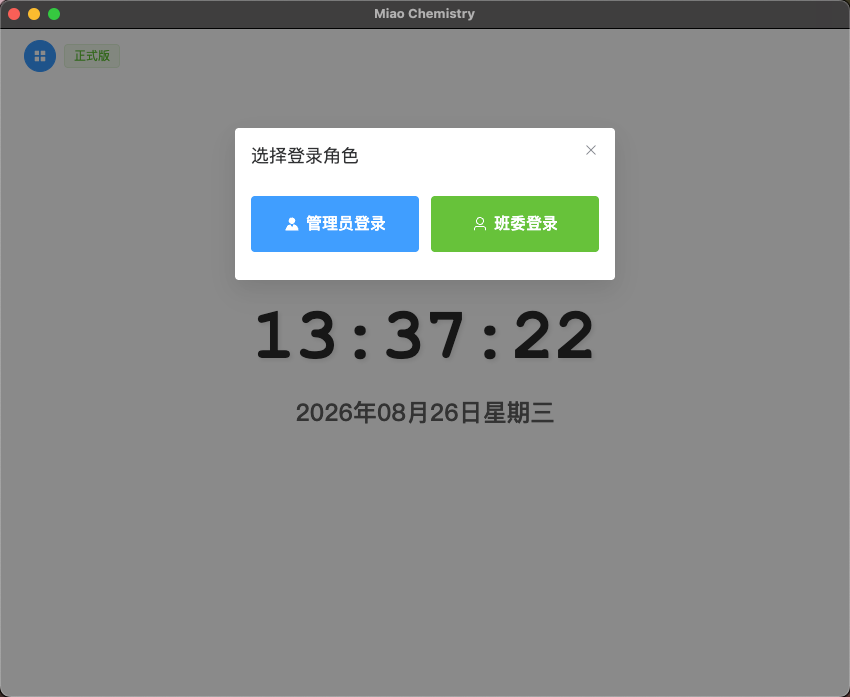

> 提示：若在「基础设置」中关闭了「周期记分」模块，则不再显示角色选择，锁屏页直接进入管理员密码登录（无班委角色）。

- 选择「管理员登录」：输入管理员密码后进入，可访问全部功能

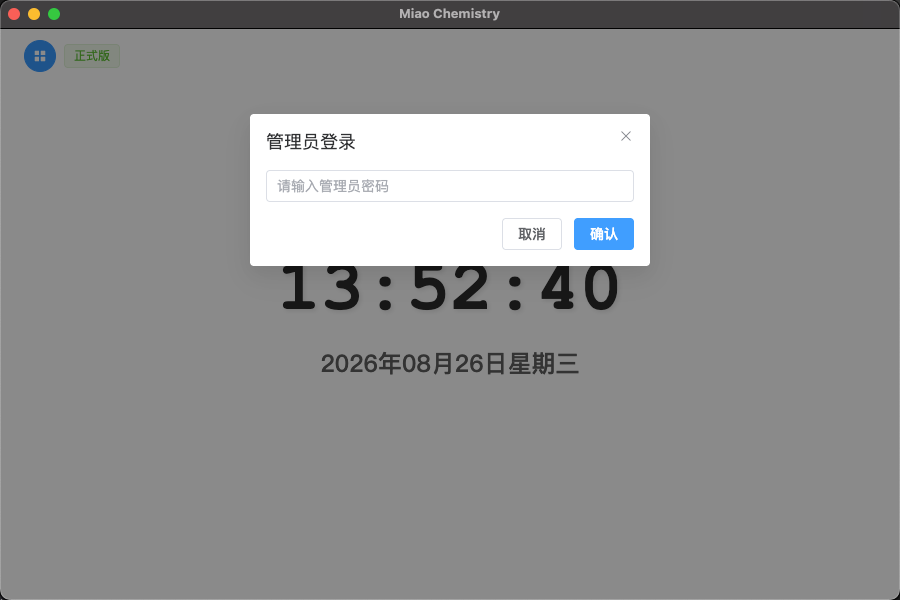

- 选择「班委登录」：选择班级 + 输入班委账号密码后，直接进入该班级的「周期记分」页（详见第 8 章）

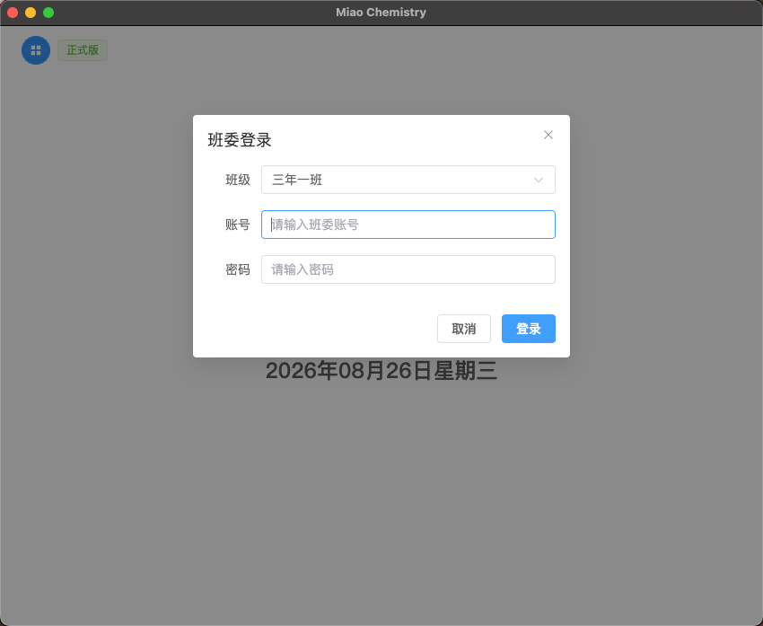

- 点击**模块切换**选择主功能，默认是积分管理

- 点击**锁按钮**返回主界面
- 点击右上角**全屏按钮**进入/退出全屏（适合投影演示），也可按 `ESC` 退出全屏

## 4. 班级管理

进入"积分管理"模块后，首页为"所有班级"。

| 操作             | 方法                                                                   |
| ---------------- | ---------------------------------------------------------------------- |
| 创建班级         | 点击"+"卡片 → 输入班级名称 → 确定                                    |
| 编辑班级         | 点击班级卡片上的编辑图标 → 修改名称 → 确定                           |
| 删除班级         | 点击班级卡片上的删除图标 → 确认删除                                   |
| 导出班级（备份） | 点击班级卡片上的下载图标 → 选择保存位置，数据以加密`.miao` 文件导出 |
| 导入班级（恢复） | 点击右下角导入按钮 → 选择之前导出的文件 → 确认导入                   |

新增班级弹窗：

点击班级卡片进入班级详情页，包含**学生管理、关联分组、独立分组、周期记分、数据分析、积分记录、积分兑换**七个标签页（各标签的展示与顺序可在「基础设置」中配置，见第 14 章）。

> 说明：「关联分组」与「独立分组」互斥，同一班级仅显示其一（默认开启「独立分组」）。

## 5. 学生管理

在班级详情页切换到"**学生管理**"标签：

### 5.1 添加学生

**单个新增**：学生管理 → "新增学生" → 输入姓名 → 确定（新学生初始积分为 0，积分通过后续加减分累积）。

**批量新增**：学生管理 → "批量新增学生"，支持两种方式：

- **TXT 文件**：每行一个学生姓名（支持中文逗号、分号分隔）
- **Excel 文件**：先下载模板，按模板填写姓名和积分后导入

导入前可逐个编辑学生信息，也可统一修改所有学生的初始积分，确认无误后点击提交。

### 5.2 日常操作

| 操作         | 方法                                 |
| ------------ | ------------------------------------ |
| 编辑学生     | 列表中点击"编辑"，修改姓名和积分     |
| 删除学生     | 列表中点击"删除"并确认               |
| 查看积分记录 | 列表中点击"记录"，可按规则、时间筛选 |
| 搜索         | 按姓名或 ID 搜索                     |
| 排序         | 按积分升序/降序                      |
| 分页         | 每页 10 / 30 / 60 条                 |

### 5.3 全量操作

点击"全量操作"下拉菜单，可对全班学生批量操作（执行前二次确认）：

| 操作           | 说明                                         |
| -------------- | -------------------------------------------- |
| 全量设置积分值 | 将全班学生积分统一设置为指定值，原积分被覆盖 |
| 全量加积分     | 为全班学生每人增加指定积分（支持负数）       |
| 全量减积分     | 为全班学生每人减少指定积分                   |

### 5.4 随机点名

1. 学生管理页点击"**随机点名**"
2. 点击"开始点名"，姓名随机滚动
3. 停止后显示被选中学生的姓名和学号

## 6. 关联分组

在班级详情页切换到"**关联分组**"标签（需在「基础设置」中开启，与「独立分组」互斥）：

### 6.1 创建与维护分组

- **新增小组**：关联分组 → "新增小组" → 输入名称 → 从学生列表勾选成员（可搜索）→ 确定
- **编辑/删除**：分组卡片上的对应按钮
- **调整排序**：点击"调整排序"，可选"根据总积分排序"或"自定义排序（拖拽）"
- **搜索**：按小组名称或学生姓名快速定位

每个分组卡片实时显示**小组总积分**和成员数量，成员旁显示各自当前积分。

### 6.2 单个学生积分调整

在分组卡片中，每个学生旁有三个按钮：

| 按钮             | 功能                                                   |
| ---------------- | ------------------------------------------------------ |
| 绿色（+）        | 按步长快速加分                                         |
| 红色（−）       | 按步长快速减分                                         |
| 黄色（票券图标） | 按规则调整：从规则列表选择规则，确认后按规则积分值调整 |

点击学生的积分标签可查看该学生的积分变动记录。所有积分变化都会自动记录。

> 快速加减的"步长"可在"基础设置"中调整（1-10 分）。

### 6.3 批量积分调整

在分组卡片底部：

- **批量加/减分**：点击绿色（+）或红色（−）按钮 → 输入积分值 → 确认后小组全员调整
- **批量按规则调整**：点击黄色按钮 → 选择规则 → 确认后小组全员按规则调整

### 6.4 积分周期（开启周期记分时）

开启「周期记分」模块后，关联分组页顶部会出现「积分周期」选择器：分组积分变动归入所选周期，周期结束后无法记分，进入页面时自动结束已过期的进行中周期。

## 7. 独立分组

在班级详情页切换到"**独立分组**"标签（默认开启，与「关联分组」互斥）。独立分组以卡片形式展示小组，**小组积分与成员个人积分相互独立**：小组级操作不影响成员，成员级操作不影响小组。

### 7.1 创建与维护小组

- **新增小组**：独立分组 → "新增小组" → 输入名称 → 从学生列表勾选成员（可搜索，**一名学生只能加入一个独立小组**）→ 确定
- **编辑/删除**：小组卡片右上角的编辑/删除按钮
- **搜索**：按小组名或成员名快速定位
- **调整排序**：点击"调整排序"，可选"根据总积分排序"或"自定义排序（拖拽）"

### 7.2 小组积分操作

每个小组卡片底部提供小组级操作（**只影响小组积分，不影响成员**）：

| 按钮               | 功能                                                       |
| ------------------ | ---------------------------------------------------------- |
| 绿色（+）          | 按步长快速加分                                             |
| 红色（−）         | 按步长快速减分                                             |
| 黄色（票券图标）   | 按规则调整：选择规则与次数，按「规则分值 × 次数」调整       |
| 灰色（列表图标）   | 查看小组积分记录                                           |

### 7.3 成员个人积分操作

小组卡片内每个成员旁有三个按钮（**只影响成员个人积分，不影响小组**）：

| 按钮             | 功能           |
| ---------------- | -------------- |
| 绿色（+）        | 按步长快速加分 |
| 红色（−）       | 按步长快速减分 |
| 黄色（票券图标） | 按规则调整     |

点击成员的积分标签可查看该学生的积分变动记录。所有积分变化自动记录。

### 7.4 积分周期（开启周期记分时）

开启「周期记分」模块后，独立分组页顶部会出现「积分周期」选择器：小组积分变动归入所选周期，周期结束后无法记分，进入页面时自动结束已过期的进行中周期。

## 8. 周期记分（班委积分）

在班级详情页切换到"**周期记分**"标签。本功能按周期组织，选定周期后**只能通过规则**给学生记分，并自动记录次数与积分明细。

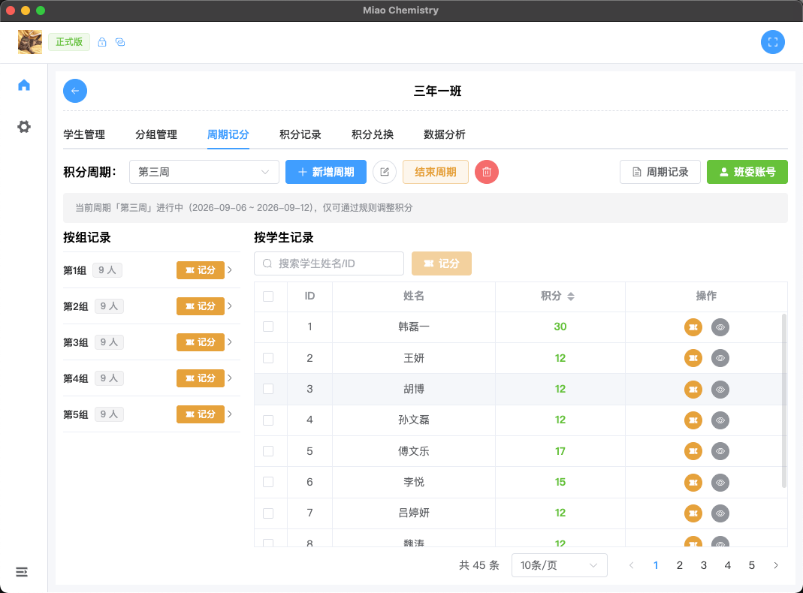

### 8.1 周期管理（仅管理员）

顶部为周期选择与管理：

| 操作     | 方法                                                                |
| -------- | ------------------------------------------------------------------- |
| 新增周期 | 点"新增周期" → 填写周期名称（如"第一周"）+ 时间范围（必填）→ 确定 |
| 编辑周期 | 点编辑图标 → 修改名称/时间范围                                     |
| 结束周期 | 进行中的周期可点"结束周期"，结束后无法再记分                        |
| 重新开始 | 已结束的周期可点"重新开始"恢复记分                                  |
| 删除周期 | 仅进行中的周期可删除，删除会同时回退学生在周期内的积分              |

> 周期时间范围**必填且不能与其他周期重叠**，系统会自动校验；进入页面时自动结束已过期的进行中周期。

### 8.2 记分（规则记分）

选定进行中的周期后，通过「规则记分」给学生们加减分，支持三种方式：

| 记分方式       | 入口                                 |
| -------------- | ------------------------------------ |
| 按学生（单个） | 学生表格中某行的「记分」按钮         |
| 按学生（多选） | 表格勾选多名学生 → 顶部「记分」按钮 |
| 按组           | 左侧小组折叠面板中的「记分」按钮     |

记分弹窗中：

1. 选择规则（加分/减分规则）
2. 可设置「记录次数」，积分 = 规则分值 × 次数
3. 确认后自动记录，累计到对应学生与周期

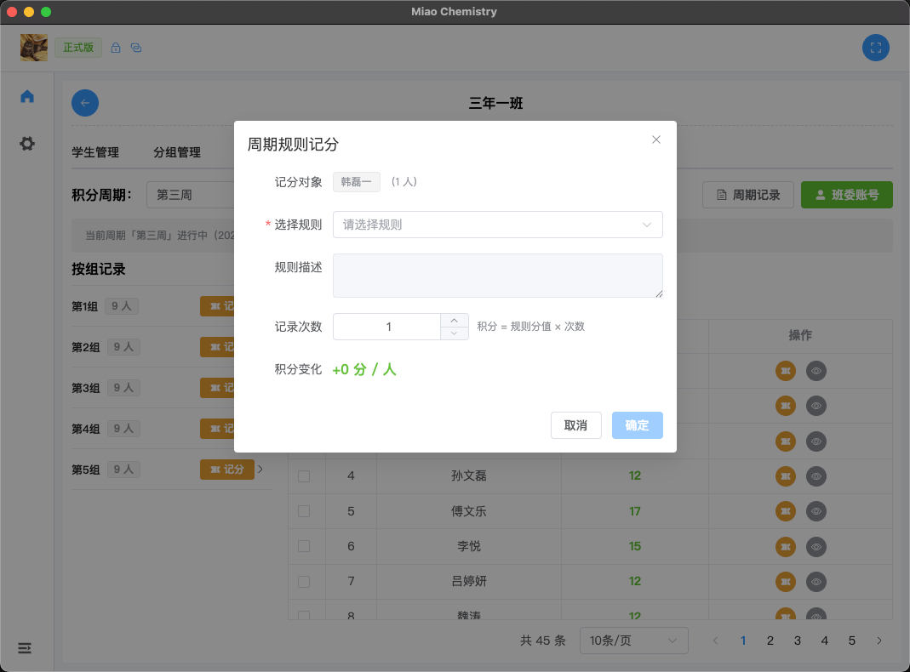

### 8.3 周期记录

点「周期记录」按钮，查看当前周期内所有记分明细，展示「规则分值 × 次数 = 总积分」，支持按时间范围过滤。

### 8.4 学生详情统计

学生表格中点「详情」按钮，弹窗展示该学生在当前周期内**每种规则被记的次数、单次分值和积分合计**。

### 8.5 班委账号管理（仅管理员）

管理员在「周期记分」页点「班委账号」按钮，管理本班级的班委账号：

- **新增账号**：输入账号名 + 密码（密码至少 4 位，加密存储）
- **改密码**：重置某账号的密码（无需旧密码）
- **删除账号**：删除班委账号

> 班委账号按班级隔离，A 班创建的账号只能登录 A 班。

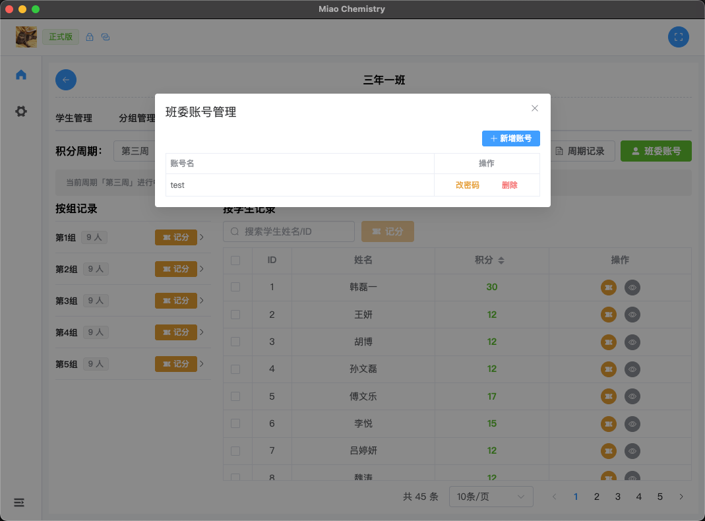

### 8.6 班委登录与权限

班委在主界面选择「班委登录」→ 选班级 + 账号密码登录后：

- 直接进入该班级的「周期记分」页，**只显示这一个标签页**
- 左侧菜单栏、左上角返回按钮均隐藏，班级名旁显示绿色「班委」标识
- 只能对**未结束的周期**记分，不能新增/修改/删除周期
- 点「退出登录」回到主界面重新选择角色

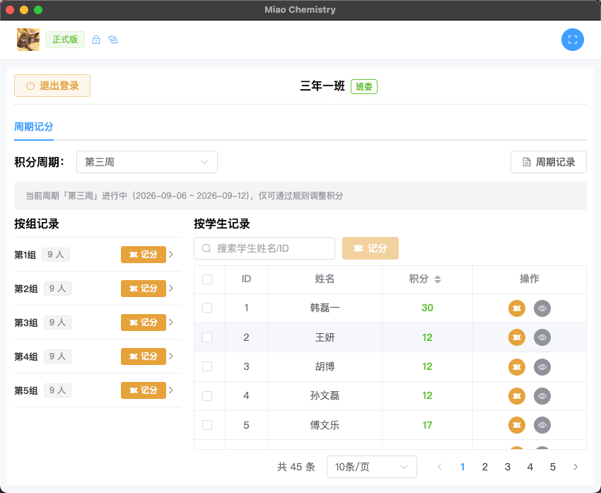

## 9. 规则设置

进入侧边菜单"全局设置 → 规则设置"。

规则采用**树形结构组织（最多两层：分组 → 规则）**，便于按「课堂表现 / 作业 / 考试 / 纪律」等维度分类管理。

### 9.1 分组与规则

- **新增分组**：点击"新增分组"，输入分组名称（如：课堂表现）
- **分组内新增规则**：分组行右侧点击"新增规则"，规则自动归入该分组
- **重命名/删除分组**：分组行右侧按钮；删除分组后，组内规则会**自动移动到「默认分组」**，不会丢失
- **默认分组**：系统内置分组，不可删除；**历史数据（旧版本扁平规则）升级后会自动归入「默认分组」**
- **内置规则库**：首次运行内置一套默认规则（学习 / 作业 / 纪律 / 考勤 / 卫生 / 文体 / 体育 / 额外嘉奖 / 期末 共 9 个分组），可按需增删改

### 9.2 创建/编辑规则

点击"新增规则"，填写：

- 所属分组（规则的上一层）
- 规则名称
- 无分值规则（开关）
- 积分值（**正数加分，负数减分**）
- 适用班级（留空表示所有班级通用）
- 规则描述

**无分值规则**：开启后该规则不设固定分值，在记分/选择规则时**必须手动填写本次分值才会生效**；关闭则需填写固定积分值。

### 9.3 管理规则

- **编辑/删除**：树形列表中对应行按钮
- **系统内置规则**：「主动加分」「主动减分」为系统规则（列表中带「系统」标记），**不可删除**（保障快捷加减分入口始终可用），可正常编辑名称/描述/分值
- **搜索筛选**：按名称、类型（加分/减分/无分值）、适用班级筛选；筛选时以扁平列表展示并带"所属分组"列
- **导入 / 导出**：两个按钮均为下拉菜单，提供「Excel」与「备份文件」两条通道，详见 9.4
- **一键清空**：删除除「主动加分 / 主动减分」外的全部规则与分组，详见 9.5
- 树形列表中分值以颜色区分：**绿色加分、红色减分、橙色无分值**

> 其它涉及规则选择的位置（按规则调整学生/小组积分、周期记分等）同样使用树形选择器，按分组展开选择规则；下拉顶部提供「加分项 / 减分项」复选（默认全选）可快速过滤，无分值规则不受过滤影响；选择无分值规则时需先填写分值。

### 9.4 导入 / 导出规则

导出与导入各有两种方式，按用途选择：

| 方式  | 入口                                            | 文件形式         | 适用场景                             |
| ----- | ----------------------------------------------- | ---------------- | ------------------------------------ |
| Excel | 导出 → 导出 Excel；导入 → 从 Excel 导入规则     | `.xlsx`          | 批量录入、手工编辑、与同事共享规则清单 |
| 备份  | 导出 → 导出备份文件；导入 → 导入备份文件         | `.miao`（加密）  | 换机迁移、完整备份还原                 |

**Excel 表格格式**：单工作表，表头为「分组 / 规则名称 / 积分值 / 适用班级 / 规则描述」，列顺序可调整，表头名称一致即可（也兼容「名称 / 积分」两列的无表头旧格式）：

- **分组**：规则所属分组，**留空归入「默认分组」**；分组不存在时导入自动创建（仍最多两层：分组 → 规则）
- **规则名称**：必填，同一分组下同名即视为重复规则
- **积分值**：正数加分、负数减分；留空或填「自定义」表示无分值规则（记分时再指定分值）
- **适用班级**：填班级名称，多个用逗号 / 顿号分隔；留空表示所有班级。名称需与系统内班级名一致，未识别的班级会在预览中提示
- **规则描述**：可选

**Excel 导入流程**：点「导入 → 从 Excel 导入规则」→（可先点「下载 Excel 模板」）→ 选择填写好的文件 → 弹窗中**按分组预览**并核对数据 → 选择重复规则策略（**跳过 / 覆盖 / 新增**）→ 确认导入，结束后提示「新增 / 覆盖 / 跳过 / 新建分组」数量。

**导出 Excel**：点「导出 → 导出 Excel」，将当前分组与规则导出为同一张表，可直接在 Excel 中批量修改后回导（重复策略选「覆盖」即可批量更新分值）。

**备份文件（.miao）**：加密保存，仅本应用可读取。导入时兼容新版（含分组）与旧版（扁平规则）两种格式，自动补建分组并提示成功 / 失败数量。

### 9.5 一键清空规则

需要推倒重来时，点右上角红色「**一键清空**」（仅在存在可删除内容时可点），弹窗会列出当前分组 / 规则数量、本次将删除的数量与保留项，必须勾选「我已了解上述影响」后才能执行。

**清空后的结果**：仅保留「默认分组」中的**主动加分**与**主动减分**，其余规则与其余分组全部删除（两条内置规则若已被改名 / 改分值，保留现状不变）。

**清空前请确认已了解**：

- 规则**不可恢复**，如需保留请先「导出备份文件」或「导出 Excel」
- 历史积分记录不会丢失，但记录中引用的已删除规则，其规则名会显示为「主动执行」，规则筛选树里归入「其他」，无法再按原规则名筛选
- 学生 / 小组按规则调整积分、周期记分等处的规则列表只剩「主动加分 / 主动减分」，需重新录入规则才能按原方式记分
- 数据分析中按规则统计的图表（行为画像、规则健康度）清空后只剩这两条规则的数据
- 「默认分组」之外的分类分组会一并删除

## 10. 奖品设置

进入侧边菜单"全局设置 → 奖品设置"。

### 10.1 添加奖品

点击"新增奖品"，填写：

- 奖品名称、所需积分、数量（库存）
- 适用班级（留空表示所有班级）
- 上传奖品图片（支持裁剪，自动压缩优化）
- 奖品描述

### 10.2 管理奖品

- **编辑/删除**：列表中对应按钮，编辑时可更换图片
- **搜索筛选**：按名称搜索、按适用班级筛选，支持分页；点击图片可预览大图
- **库存状态**：绿色=充足，黄色=紧张（少于 10），红色=售罄（0）

## 11. 积分兑换

在班级详情页切换到"**积分兑换**"标签：

1. 查看可兑换奖品（仅显示有库存的奖品）
2. 点击奖品的"兑换"按钮，查看奖品详情（图片、所需积分、剩余数量）
3. 系统自动筛选出**积分足够**的学生，可按姓名搜索
4. 选择一名学生 → 点击"确认竞拍" → 二次确认
5. 兑换完成后：学生积分扣除、库存减 1、自动生成"积分兑换"记录

**注意事项**：

- 每次只能为一名学生兑换
- 积分不足的学生不会出现在候选列表
- **兑换不可撤销**，请确认后再操作
- 在积分记录中点击兑换记录的问号图标可查看奖品详情

## 12. 积分记录

在班级详情页切换到"**积分记录**"标签：

- 查看本班所有积分变动记录
- 支持按学生 ID、学生姓名筛选；**规则名称树形多选**（按分组展开、可勾选多条规则、可输入关键字搜索规则名；兑奖与已删除规则归入「其他」分组）
- 支持按类型筛选（加分/减分）
- 支持按周期筛选（按周期时间范围过滤，未开启周期记分时自动隐藏）
- 积分变化列展示「规则分值 × 次数 = 总积分」，多次记分带 ×N 次数角标
- 支持分页浏览

## 13. 数据分析

在班级详情页切换到"**数据分析**"标签：

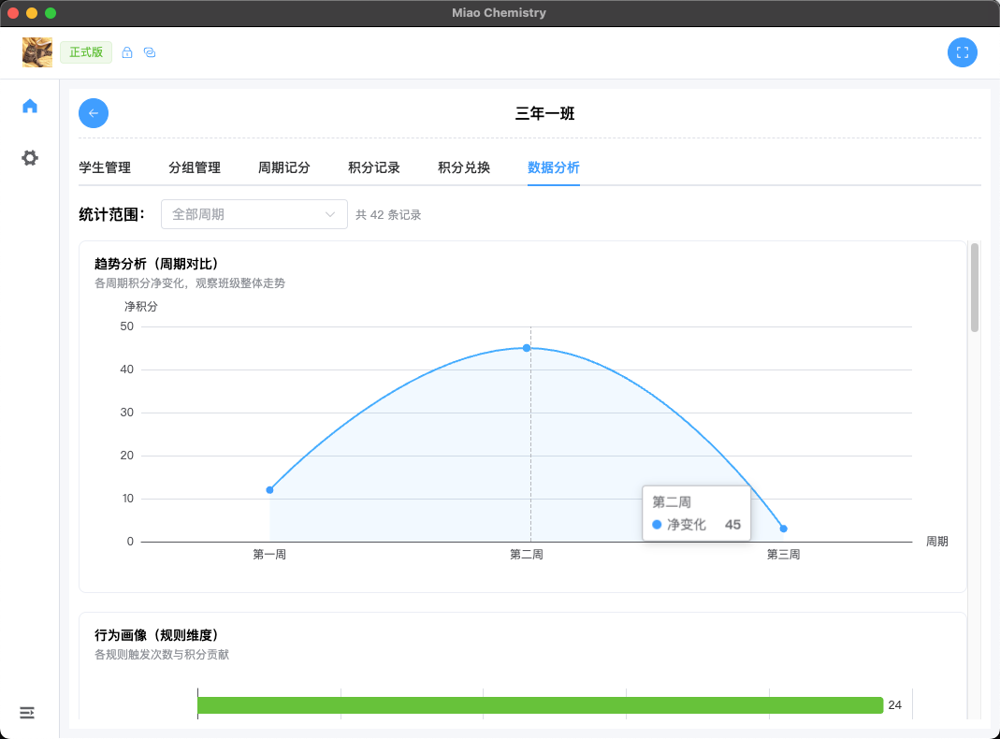
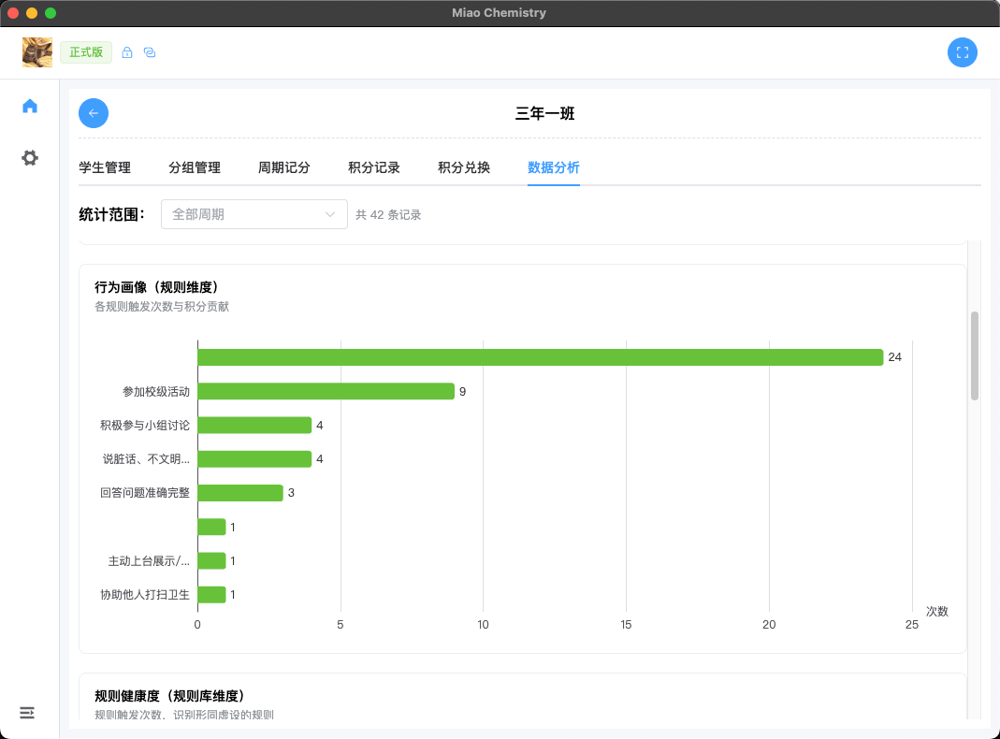
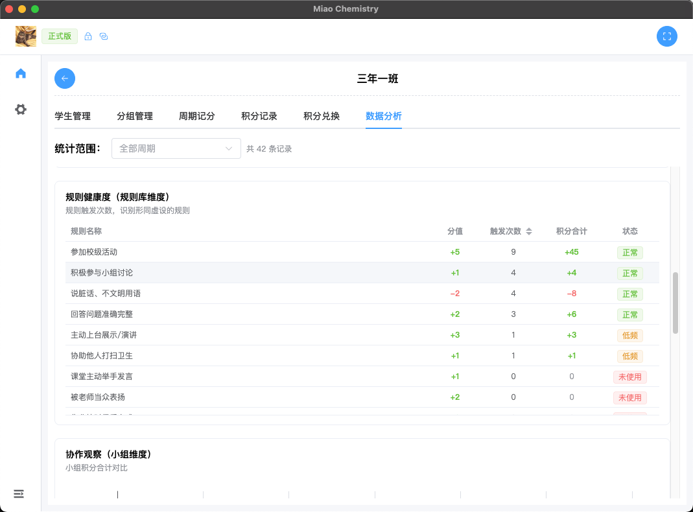
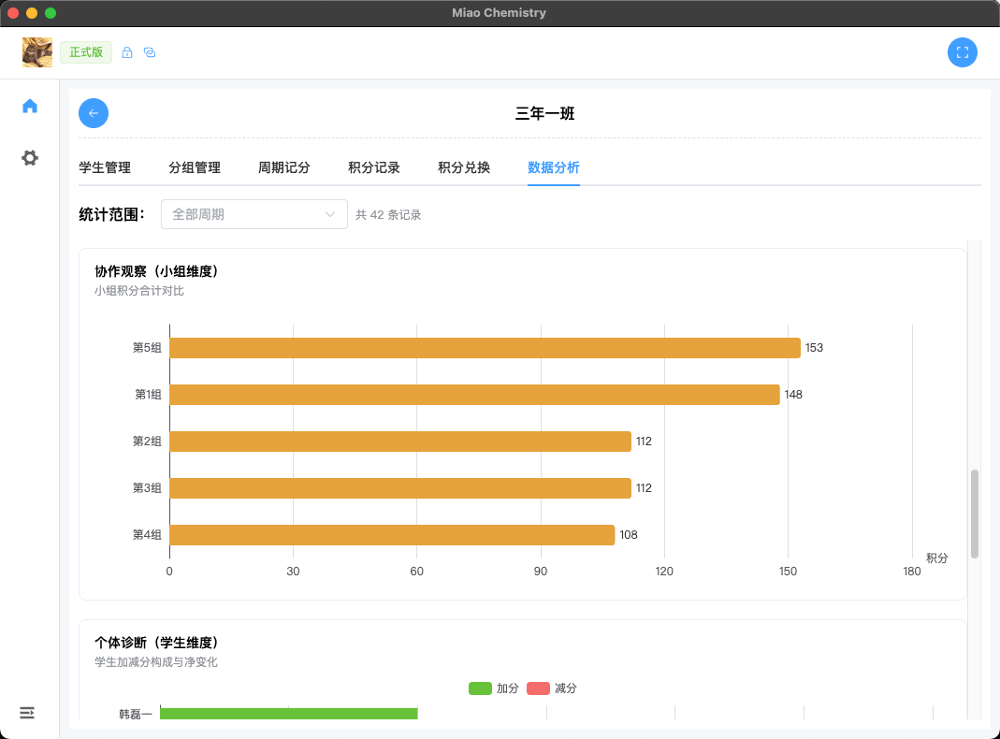
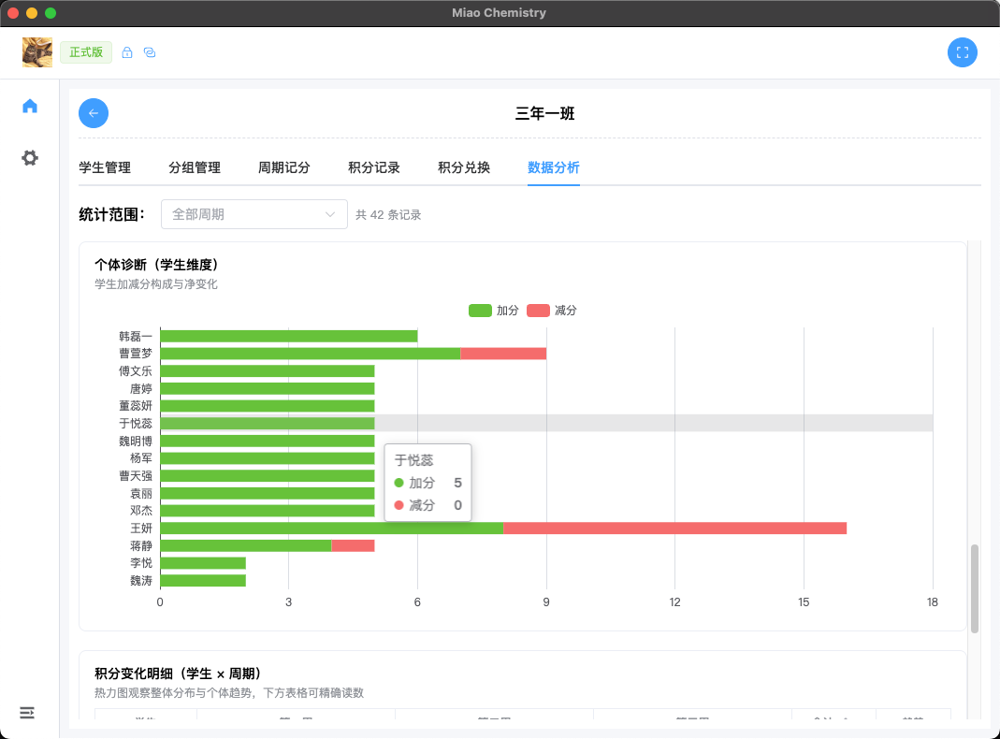
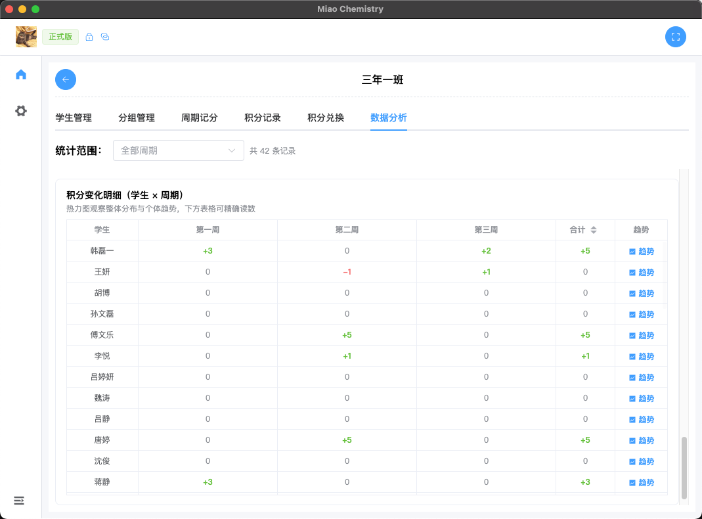
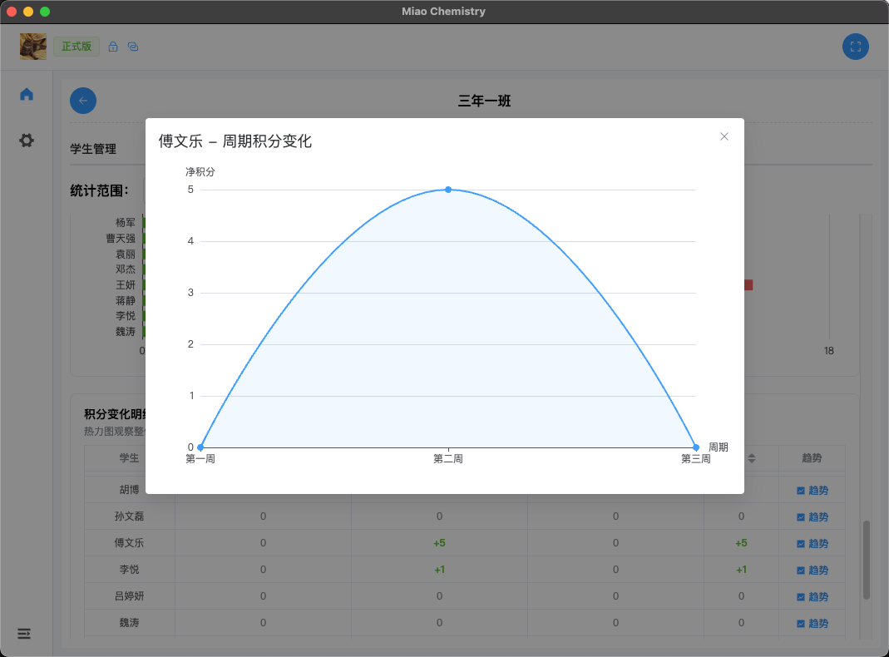

顶部「统计范围」下拉可选择「全部周期」或某个周期进行筛选。共六个可视化模块（展示与顺序可在「基础设置」中配置）：

| 模块                         | 说明                                                                      |
| ---------------------------- | ------------------------------------------------------------------------- |
| 个体诊断（学生维度）         | 堆叠柱状图展示学生加减分构成，可展开查看该学生各项规则的分值、次数与积分   |
| 积分变化明细（学生 × 周期） | 热力图 + 表格，展示每个学生在各周期的积分变化，可点「趋势」查看个人折线图，并可查看「各周期规则执行次数」统计 |
| 行为画像（规则维度）         | 横向柱状图展示各规则触发次数，识别高频行为                                |
| 趋势分析（周期对比）         | 折线图展示各周期积分净变化，观察班级整体走势                              |
| 规则健康度（规则库维度）     | 表格列出规则触发次数，标记「未使用/低频/正常」                            |
| 协作观察（小组维度）         | 柱状图对比小组积分合计（仅有小组时显示）                                  |

> 说明：数据分析依赖「周期记分」模块，关闭周期记分后数据分析标签自动隐藏。

## 14. 基础设置

进入侧边菜单"全局设置 → 基础设置"。

### 14.1 积分步长

- 调整快速加减分按钮每次变化的积分值，范围 1-10
- 修改后自动保存

### 14.2 修改密码

1. 点击密码输入框旁的编辑按钮
2. 输入原密码和新密码
3. 确定后生效（密码加密存储）

> 请牢记密码。首次启动弹窗中的初始密码只显示一次。

### 14.3 班级管理模块展示设置

拖拽排序 + 开关控制班级详情页各标签（学生管理、关联分组、独立分组、周期记分、积分记录、积分兑换、数据分析）的**顺序和显隐**，设置自动持久化，重启后保留。

补充说明：

- **关联分组 / 独立分组互斥**：两者只能开启一个，开启其一会自动关闭另一个
- **关闭周期记分的连锁影响**：关联分组/独立分组隐藏「积分周期」、数据分析自动隐藏、锁屏页直接进入管理员登录（无班委角色）

### 14.4 数据分析图表展示设置

拖拽排序 + 开关控制数据分析页六个图表的**顺序和显隐**，设置自动持久化。

## 15. 推箱子游戏

通过左上角模块菜单切换到"推箱子"：

- **目标**：用方向键控制角色（小猫），把所有箱子推到指定位置（门）即可过关
- **界面**：顶部显示计时、步骤数、当前关卡（共 10 关）
- **操作按钮**：重玩本关、上一关、下一关
- 关卡难度递增；通关后显示祝贺弹窗

## 16. 数据备份与恢复

### 16.1 备份（导出）

1. 在"所有班级"页面，点击班级卡片的下载按钮
2. 选择保存位置
3. 班级数据（学生、分组、积分、记录、周期、班委账号）以加密格式导出

**建议定期备份重要班级数据。**

### 16.2 恢复（导入）

1. 点击班级页面右下角的导入按钮
2. 选择之前导出的加密文件
3. 系统自动解密验证，确认后完成恢复

### 16.3 数据安全说明

- 所有数据存储在本机用户目录，经 AES 加密保护
- 导出文件为专用加密格式，无法被直接查看
- 不支持云同步，可通过导出/导入在不同电脑间迁移数据

## 17. 常见问题（FAQ）

**Q：忘记初始密码怎么办？**
A：初始密码仅在首次启动时显示一次并已复制到剪贴板。若已丢失且无法进入系统，请联系作者处理。

**Q：忘记班委账号密码怎么办？**
A：管理员登录后，进入对应班级的"周期记分 → 班委账号"，点"改密码"重置即可（无需旧密码）。

**Q：班委能操作哪些内容？**
A：班委仅能进入自己班级的"周期记分"，且只能对未结束的周期记分；不能新增/修改/删除周期，也看不到其他标签页和管理功能。

**Q：关联分组和独立分组有什么区别？**
A：关联分组中，成员与小组积分联动（成员加减分计入小组）；独立分组中，小组积分与成员个人积分相互独立，小组级操作不影响成员、成员级操作不影响小组，且一名学生只能加入一个独立小组。两者互斥，同一班级只能开启其一。

**Q：数据丢失怎么办？**
A：如有备份文件，通过导入功能恢复。建议养成定期导出备份的习惯。

**Q：如何重置应用？**
A：删除用户目录下的应用数据文件夹后重启应用（macOS：`~/Library/Application Support/miao-chemistry`；Windows：`%APPDATA%\miao-chemistry`）。注意此操作会清空所有数据。

**Q：支持多班级吗？**
A：支持。每个班级的学生、分组、积分、记录、周期、班委账号相互独立；规则和奖品可指定适用班级或全局通用。

**Q：换电脑如何迁移数据？**
A：在旧电脑逐个导出班级数据，在新电脑导入即可。规则也支持单独导出导入。

**Q：兑换错了能撤销吗？**
A：不能。兑换前会有二次确认，请仔细核对学生和奖品。

**Q：奖品图片支持什么格式？**
A：常见格式（JPG、PNG 等），系统自动压缩优化，支持裁剪。

**Q：试用期到了会丢数据吗？**
A：不会，应用仅锁定功能，数据仍保留在本地。升级正式版后可继续使用。

**Q：如何更新应用？**
A：下载新版安装包覆盖安装即可，本地数据自动保留。

## 18. 技术支持

- 作者：chunlei.wang
- 邮箱：<lei021101@163.com>
- 如遇到问题或有功能建议，欢迎邮件反馈

---

**Miao教学管理系统** —— 让教学管理更简单，让课堂互动更有趣！
