# Miao教学管理系统 · 使用手册

> 本手册面向教师用户，介绍 Miao积分管理 的安装、日常使用和数据管理方法。

## 1. 系统简介

Miao教学管理系统是一款面向教师的桌面端课堂互动激励工具，无需联网即可使用，主要功能：

- **小组积分管理**：多班级管理、学生与分组积分加减、自定义规则、奖品兑换、记录追溯
- **随机点名**：动画抽取学生，活跃课堂气氛
- **推箱子游戏**：课堂互动小游戏，多关卡挑战

所有数据加密存储在本机，支持导入导出备份。

## 2. 安装与启动

### 2.1 安装

| 系统 | 安装包 | 说明 |
| --- | --- | --- |
| Windows 10+ | `.exe` / `.msi` | 双击安装，或使用 `.zip` 绿色版解压即用 |
| macOS 10.13+ | `.dmg` | 打开后将应用拖入"应用程序"文件夹 |

### 2.2 首次启动（重要）

首次打开应用会弹窗显示**初始访问密码，且只显示一次**：

1. 弹窗提示"当前密码为：XXXXXX"
2. 点击"确认"后密码自动复制到剪贴板
3. **请立即将密码记录在安全的地方**
4. 建议尽快在"基础设置"中修改为自己的密码

### 2.3 版本说明

| 版本 | 使用时长 |
| --- | --- |
| 基础试用版 | 7 天 |
| 优惠体验版 | 30 天 |
| 正式永久版 | 永久 |

试用版到期后应用会自动锁定，请联系作者获取正式版。

## 3. 主界面与模块切换

- 启动后进入主界面（时钟屏保页），左上角显示蓝色圆形菜单按钮与版本标识（如“试用版:剩余X天”）

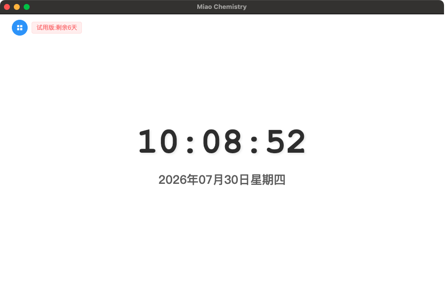

- 点击左上角菜单按钮可展开模块菜单，在“积分管理”“推箱子”之间切换

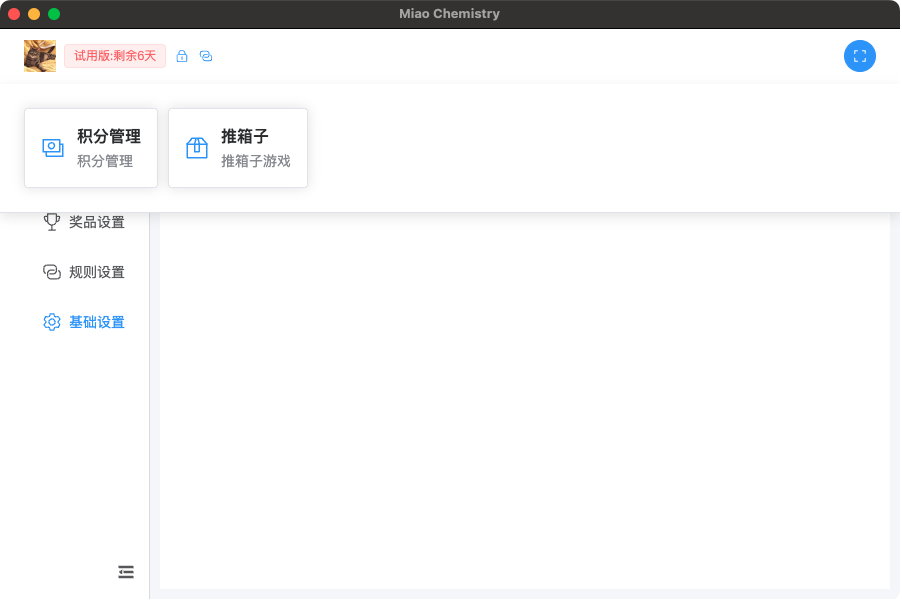

- 点击**锁按钮**返回主界面
- 点击右上角**全屏按钮**进入/退出全屏（适合投影演示），也可按 `ESC` 退出全屏

## 4. 班级管理

进入“积分管理”模块后，首页为“所有班级”。

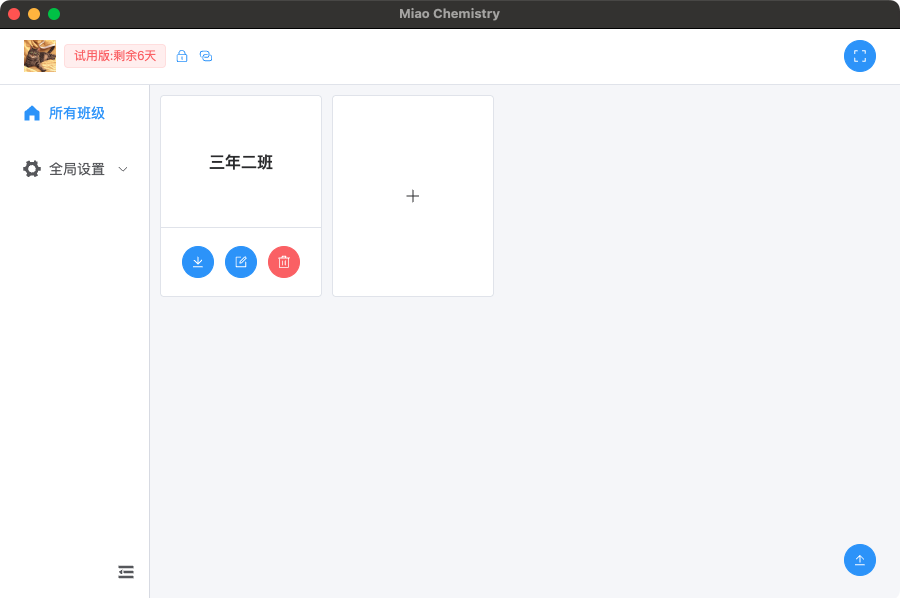

| 操作 | 方法 |
| --- | --- |
| 创建班级 | 点击"+"卡片 → 输入班级名称 → 确定 |
| 编辑班级 | 点击班级卡片上的编辑图标 → 修改名称 → 确定 |
| 删除班级 | 点击班级卡片上的删除图标 → 确认删除 |
| 导出班级（备份） | 点击班级卡片上的下载图标 → 选择保存位置，数据以加密 `.miao` 文件导出 |
| 导入班级（恢复） | 点击右下角导入按钮 → 选择之前导出的文件 → 确认导入 |

新增班级弹窗：

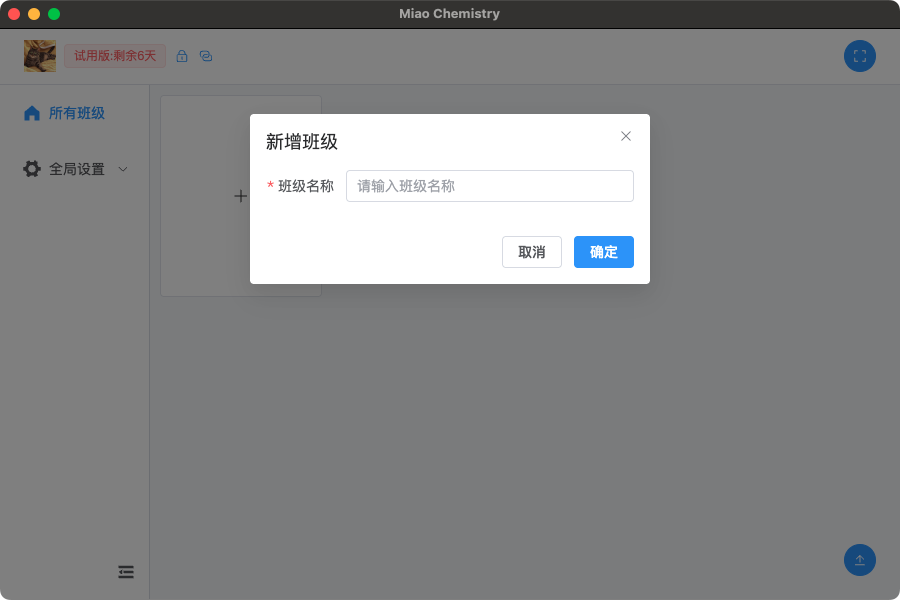

点击班级卡片进入班级详情页，包含**分组管理、学生管理、积分记录、积分兑换**四个标签页。

## 5. 学生管理

在班级详情页切换到“**学生管理**”标签：

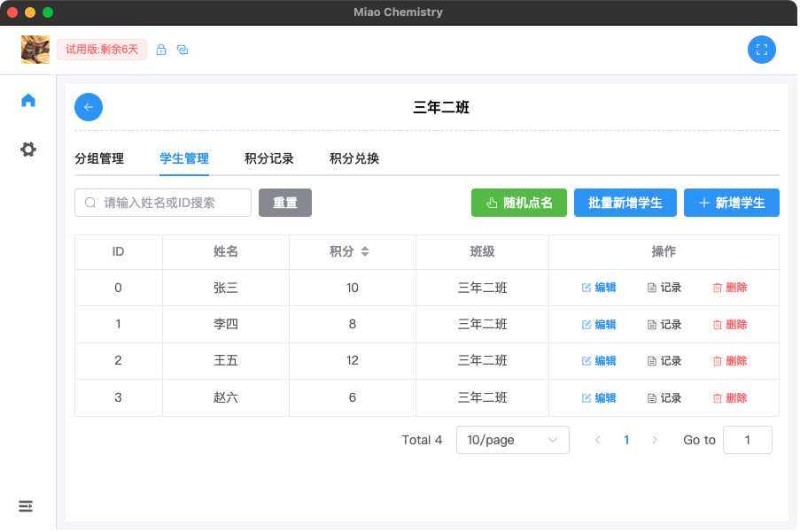

### 5.1 添加学生

**单个新增**：学生管理 → “新增学生” → 输入姓名和初始积分 → 确定。

**批量新增**：学生管理 → “批量新增学生”，支持两种方式：

- **TXT 文件**：每行一个学生姓名（支持中文逗号、分号分隔）
- **Excel 文件**：先下载模板，按模板填写姓名和积分后导入

导入前可逐个编辑学生信息，也可统一修改所有学生的初始积分，确认无误后点击提交。

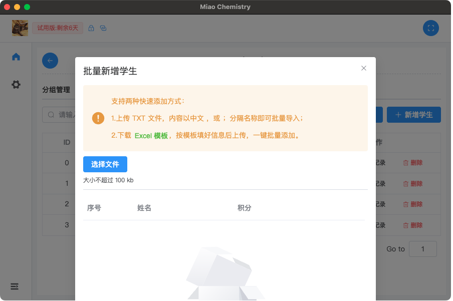

### 5.2 日常操作

| 操作 | 方法 |
| --- | --- |
| 编辑学生 | 列表中点击"编辑"，修改姓名和积分 |
| 删除学生 | 列表中点击"删除"并确认 |
| 查看积分记录 | 列表中点击"记录"，可按规则、时间筛选 |
| 搜索 | 按姓名或 ID 搜索 |
| 排序 | 按积分升序/降序 |
| 分页 | 每页 10 / 30 / 60 条 |

### 5.3 随机点名

1. 学生管理页点击“**随机点名**”
2. 点击“开始点名”，姓名随机滚动
3. 停止后显示被选中学生的姓名和学号

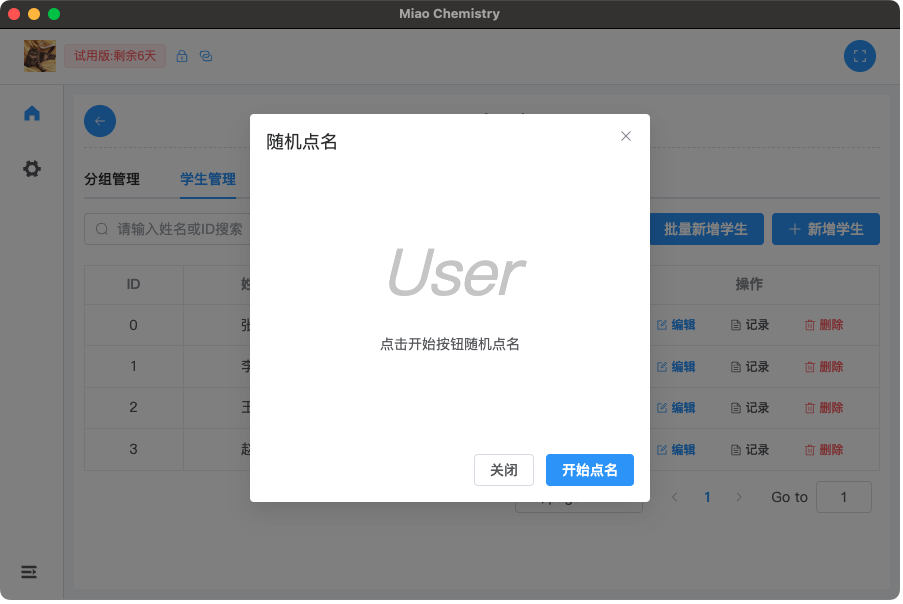

## 6. 分组管理

在班级详情页切换到“**分组管理**”标签：

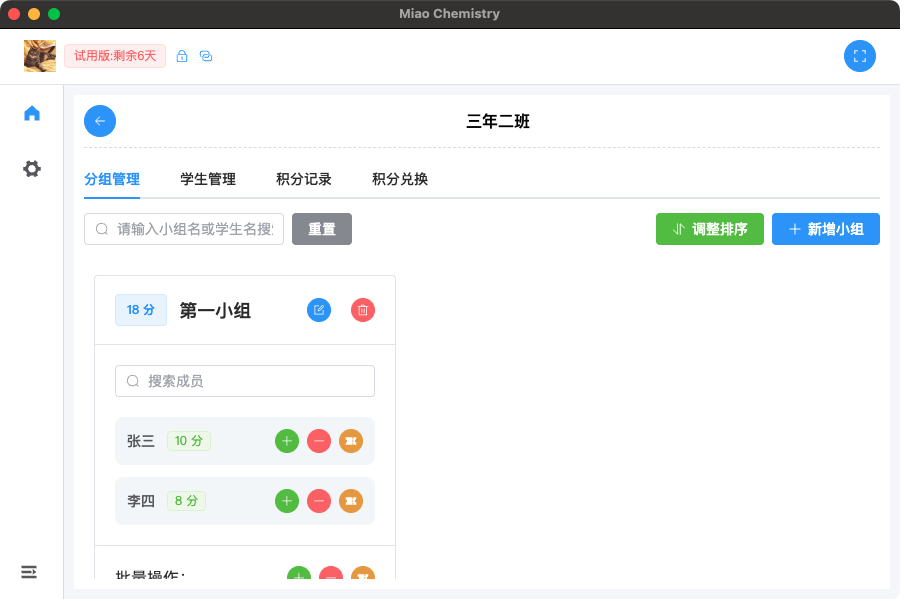

### 6.1 创建与维护分组

- **新增小组**：分组管理 → “新增小组” → 输入名称 → 从学生列表勾选成员（可搜索）→ 确定
- **编辑/删除**：分组卡片上的对应按钮
- **调整排序**：点击"调整排序"，可选"根据总积分排序"或"自定义排序（拖拽）"
- **搜索**：按小组名称或学生姓名快速定位

每个分组卡片实时显示**小组总积分**和成员数量，成员旁显示各自当前积分。

### 6.2 单个学生积分调整

在分组卡片中，每个学生旁有三个按钮：

| 按钮 | 功能 |
| --- | --- |
| 绿色（+） | 按步长快速加分 |
| 红色（−） | 按步长快速减分 |
| 黄色（票券图标） | 按规则调整：从规则列表选择规则，确认后按规则积分值调整 |

点击学生的积分标签可查看该学生的积分变动记录。所有积分变化都会自动记录。

> 快速加减的"步长"可在"基础设置"中调整（1-10 分）。

### 6.3 批量积分调整

在分组卡片底部：

- **批量加/减分**：点击绿色（+）或红色（−）按钮 → 输入积分值 → 确认后小组全员调整
- **批量按规则调整**：点击黄色按钮 → 选择规则 → 确认后小组全员按规则调整

## 7. 规则设置

进入侧边菜单“全局设置 → 规则设置”。

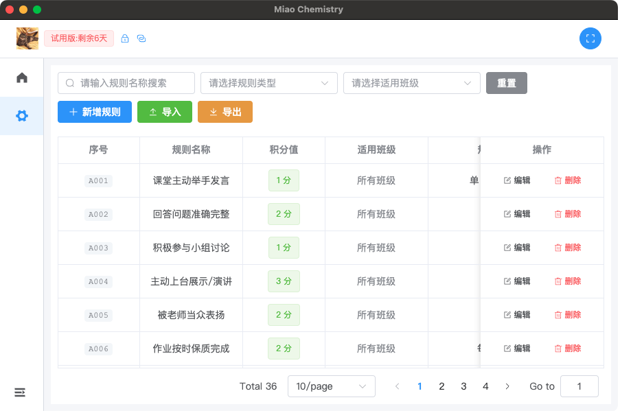

### 7.1 创建规则

点击"新增规则"，填写：

- 规则名称
- 积分值（**正数加分，负数减分**）
- 适用班级（留空表示所有班级通用）
- 规则描述

### 7.2 管理规则

- **编辑/删除**：列表中对应按钮
- **搜索筛选**：按名称搜索，按类型（加分/减分）、适用班级筛选，支持分页
- **导出**：点击"导出"，规则以加密文件保存，可分享给其他设备
- **导入**：点击"导入"选择加密规则文件，系统自动解密导入并提示成功/失败数量
- 列表中积分值以颜色区分：**绿色加分、红色减分**

## 8. 奖品设置

进入侧边菜单“全局设置 → 奖品设置”。

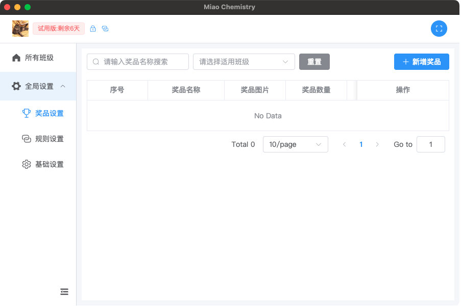

### 8.1 添加奖品

点击"新增奖品"，填写：

- 奖品名称、所需积分、数量（库存）
- 适用班级（留空表示所有班级）
- 上传奖品图片（支持裁剪，自动压缩优化）
- 奖品描述

### 8.2 管理奖品

- **编辑/删除**：列表中对应按钮，编辑时可更换图片
- **搜索筛选**：按名称搜索、按适用班级筛选，支持分页；点击图片可预览大图
- **库存状态**：绿色=充足，黄色=紧张（少于 10），红色=售罄（0）

## 9. 积分兑换

在班级详情页切换到"**积分兑换**"标签：

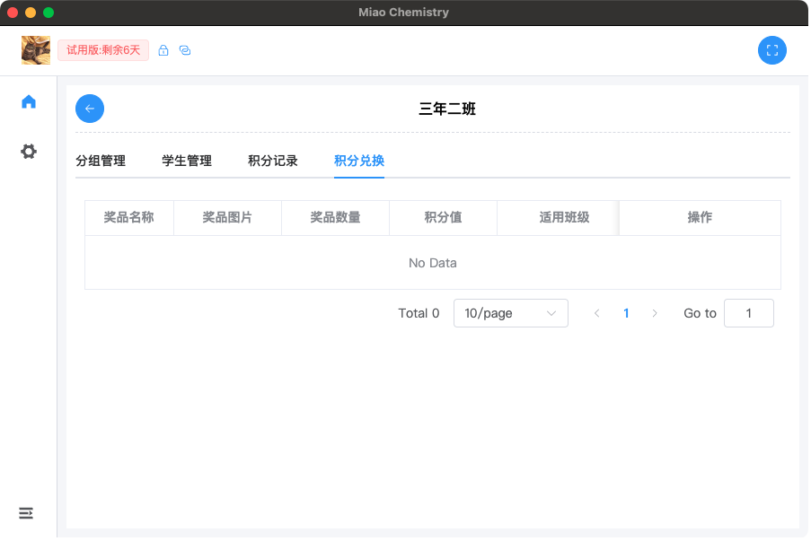

1. 查看可兑换奖品（仅显示有库存的奖品）
2. 点击奖品的"兑换"按钮，查看奖品详情（图片、所需积分、剩余数量）
3. 系统自动筛选出**积分足够**的学生，可按姓名搜索
4. 选择一名学生 → 点击"确认竞拍" → 二次确认
5. 兑换完成后：学生积分扣除、库存减 1、自动生成"积分兑换"记录

**注意事项**：

- 每次只能为一名学生兑换
- 积分不足的学生不会出现在候选列表
- **兑换不可撤销**，请确认后再操作
- 在积分记录中点击兑换记录的问号图标可查看奖品详情

## 10. 积分记录

在班级详情页切换到“**积分记录**”标签：

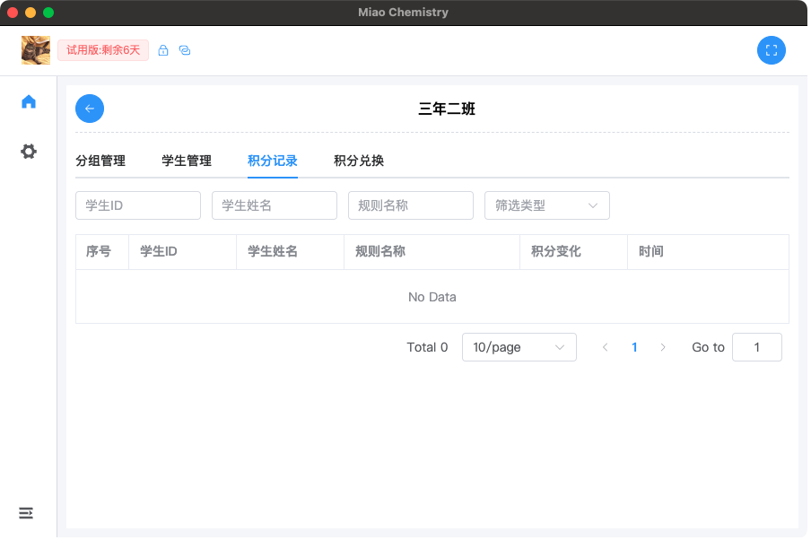

- 查看本班所有积分变动记录
- 支持按学生 ID、学生姓名、规则名称筛选
- 支持按类型筛选（加分/减分）
- 支持分页浏览

## 11. 基础设置

进入侧边菜单“全局设置 → 基础设置”。

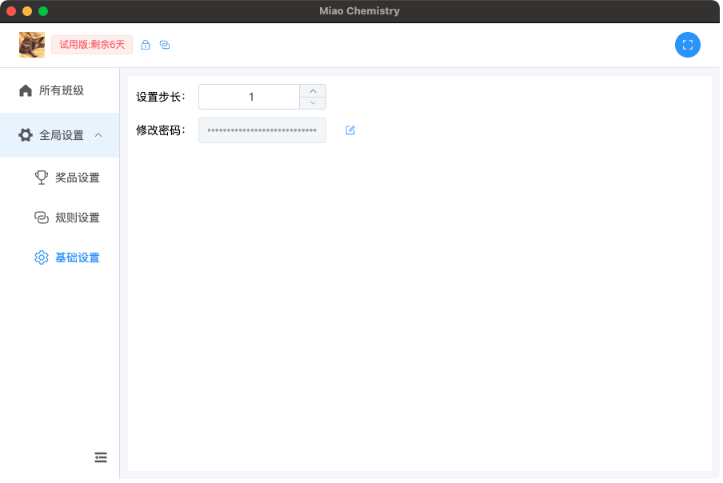

### 11.1 积分步长

- 调整快速加减分按钮每次变化的积分值，范围 1-10
- 修改后自动保存

### 11.2 修改密码

1. 点击密码输入框旁的编辑按钮
2. 输入原密码和新密码
3. 确定后生效（密码加密存储）

> 请牢记密码。首次启动弹窗中的初始密码只显示一次。

## 12. 推箱子游戏

通过左上角模块菜单切换到“推箱子”：

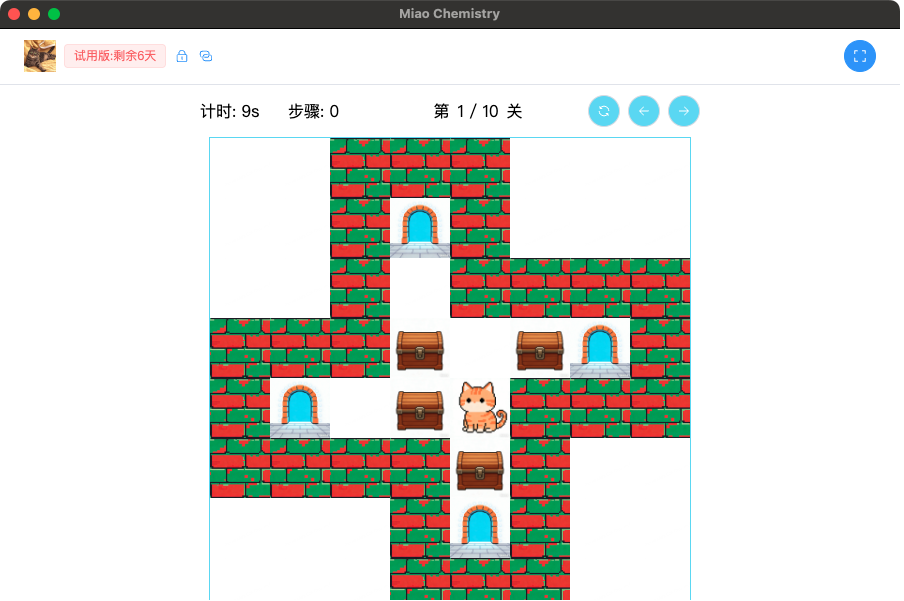

- **目标**：用方向键控制角色（小猫），把所有箱子推到指定位置（门）即可过关
- **界面**：顶部显示计时、步骤数、当前关卡（共 10 关）
- **操作按钮**：重玩本关、上一关、下一关
- 关卡难度递增；通关后显示祝贺弹窗

## 13. 数据备份与恢复

### 13.1 备份（导出）

1. 在"所有班级"页面，点击班级卡片的下载按钮
2. 选择保存位置
3. 班级数据（学生、分组、积分、记录）以加密格式导出

**建议定期备份重要班级数据。**

### 13.2 恢复（导入）

1. 点击班级页面右下角的导入按钮
2. 选择之前导出的加密文件
3. 系统自动解密验证，确认后完成恢复

### 13.3 数据安全说明

- 所有数据存储在本机用户目录，经 AES 加密保护
- 导出文件为专用加密格式，无法被直接查看
- 不支持云同步，可通过导出/导入在不同电脑间迁移数据

## 14. 常见问题（FAQ）

**Q：忘记初始密码怎么办？**
A：初始密码仅在首次启动时显示一次并已复制到剪贴板。若已丢失且无法进入系统，请联系作者处理。

**Q：数据丢失怎么办？**
A：如有备份文件，通过导入功能恢复。建议养成定期导出备份的习惯。

**Q：如何重置应用？**
A：删除用户目录下的应用数据文件夹后重启应用（macOS：`~/Library/Application Support/miao-chemistry`；Windows：`%APPDATA%\miao-chemistry`）。注意此操作会清空所有数据。

**Q：支持多班级吗？**
A：支持。每个班级的学生、分组、积分、记录相互独立；规则和奖品可指定适用班级或全局通用。

**Q：换电脑如何迁移数据？**
A：在旧电脑逐个导出班级数据，在新电脑导入即可。规则也支持单独导出导入。

**Q：兑换错了能撤销吗？**
A：不能。兑换前会有二次确认，请仔细核对学生和奖品。

**Q：奖品图片支持什么格式？**
A：常见格式（JPG、PNG 等），系统自动压缩优化，支持裁剪。

**Q：试用期到了会丢数据吗？**
A：不会，应用仅锁定功能，数据仍保留在本地。升级正式版后可继续使用。

**Q：如何更新应用？**
A：下载新版安装包覆盖安装即可，本地数据自动保留。

## 15. 技术支持

- 作者：chunlei.wang
- 邮箱：lei021101@163.com
- 如遇到问题或有功能建议，欢迎邮件反馈

---

**Miao教学管理系统** —— 让教学管理更简单，让课堂互动更有趣！
